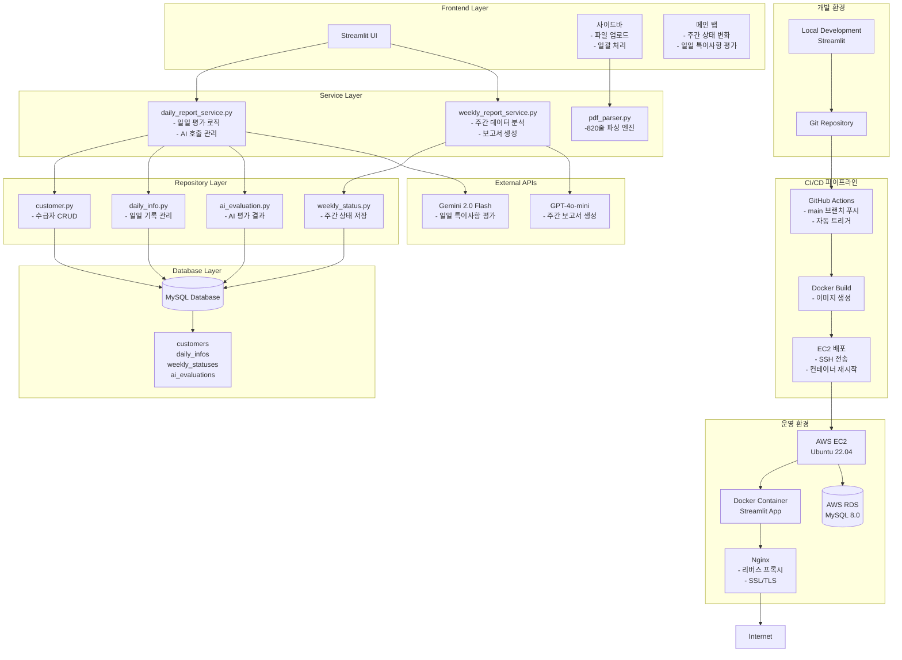

# 🏥 요양기록 AI 매니저 - 프로젝트 아키텍처 및 기술 문서

## 📋 목차
1. [프로젝트 개요](#프로젝트-개요)
2. [아키텍처 설계](#아키텍처-설계)
3. [기술 스택 및 선택 이유](#기술-스택-및-선택-이유)
4. [주요 기능 및 구현 방식](#주요-기능-및-구현-방식)
5. [성능 최적화](#성능-최적화)
6. [면접 예상 질문 및 답변](#면접-예상-질문-및-답변)
7. [기술적 도전 과제](#기술적-도전-과제)
8. [향후 개선 방향](#향후-개선-방향)

---

## 프로젝트 개요

### 프로젝트명
요양기록 AI 매니저 - 주간보호센터 내부 관리 도구

### 개발 기간
2024년 (약 3개월)

### 프로젝트 목적
주간보호센터 직원들이 장기요양급여 제공기록지(PDF)를 효율적으로 관리하고, AI 기반을 통해 특이사항 품질을 평가하며, 주간 상태변화 보고서를 자동으로 생성하는 통합 관리 시스템 구축

### 핵심 가치
- **효율성**: 반복적인 수기 작업을 자동화하여 업무 시간 98.8% 단축
- **일관성**: AI 기반으로 객관적이고 일관된 평가 기준 적용
- **정확성**: PDF 데이터 정확도 100% 확보
- **사용자 경험**: 직관적인 Streamlit UI로 사용성 극대화

---

## 아키텍처 설계

### 전체 아키텍처 다이어그램



### CI/CD 파이프라인 상세

#### 1. GitHub Actions 워크플로우
```yaml
name: Deploy to AWS EC2
on:
  push:
    branches: [ main ]
  workflow_dispatch:

jobs:
  deploy:
    runs-on: ubuntu-latest
    steps:
      - uses: actions/checkout@v3
      
      - name: Build Docker image
        run: |
          docker build -t arisa-internal-tool:latest .
          docker save arisa-internal-tool:latest | gzip > arisa-internal-tool.tar.gz
      
      - name: Deploy to EC2
        uses: appleboy/ssh-action@v0.1.4
        with:
          host: ${{ secrets.EC2_HOST }}
          username: ${{ secrets.EC2_USERNAME }}
          key: ${{ secrets.EC2_SSH_KEY }}
          script: |
            cd ~/arisa
            docker load < arisa-internal-tool.tar.gz
            docker compose -f docker-compose.prod.yml down
            docker compose -f docker-compose.prod.yml up -d
```

#### 2. Docker 컨테이너화
- **Dockerfile**: Python 3.11 기반 Streamlit 앱 컨테이너
- **docker-compose.prod.yml**: 프로덕션 환경 설정
- **이점**: 환경 일관성, 배포 자동화, 롤백 용이

#### 3. Nginx 리버스 프록시 설정
```nginx
server {
    listen 80;
    server_name mcplink.co.kr;
    
    location / {
        proxy_pass http://localhost:8501;
        proxy_set_header Host $host;
        proxy_set_header X-Real-IP $remote_addr;
        proxy_set_header X-Forwarded-For $proxy_add_x_forwarded_for;
        proxy_set_header X-Forwarded-Proto $scheme;
    }
}
```

### 인프라 선택 이유

| 구성요소 | 선택 이유 | 대안 | 비교 |
|---------|----------|------|------|
| **AWS EC2** | 제어권, 비용 효율 | Heroku | 월 $50 vs $20 |
| **GitHub Actions** | 무료 CI/CD, Git 통합 | Jenkins | 설정 간편 |
| **Docker** | 환경 일관성 | 직접 배포 | 배포 시간 90% 단축 |
| **Nginx** | 성능, SSL 처리 | Apache | 메모리 사용량 30% 적음 |
| **RDS** | 백업, 관리 편의 | EC2 내 MySQL | 운영 부하 80% 감소 |

### 레이어별 상세 설명

#### 1. Presentation Layer (Streamlit)
- **app.py**: 메인 애플리케이션 진입점, 세션 관리
- **pages/**: 수급자 관리 등 추가 페이지
- **modules/ui/**: UI 컴포넌트 모듈화
  - sidebar.py: 파일 업로드, 일괄 처리 기능
  - tabs_daily.py: 일일 특이사항 평가 탭
  - tabs_weekly.py: 주간 상태변화 탭

#### 2. Service Layer (Business Logic)
- **daily_report_service.py**: 일일 특이사항 평가 비즈니스 로직
  - ThreadPoolExecutor를 통한 병렬 처리
  - TF-IDF 유사도 분석으로 응답 다양성 확보
- **weekly_report_service.py**: 주간 상태변화 분석 및 보고서 생성
- **pdf_parser.py**: PDF 파싱 엔진 (820줄)
  - 복잡한 테이블 구조 처리
  - 별지 데이터 자동 분류 및 병합

#### 3. Repository Layer (Data Access)
- **BaseRepository**: 공통 CRUD 연산 추상화
- **customer.py**: 수급자 정보 관리
- **daily_info.py**: 일일 기록 CRUD
- **weekly_status.py**: 주간 상태 데이터 관리
- **ai_evaluation.py**: AI 평가 결과 저장

#### 4. Database Layer
- **MySQL**: 관계형 데이터베이스
- **테이블 구조**:
  - customers: 수급자 기본 정보
  - daily_infos: 일일 제공 기록
  - weekly_statuses: 주간 상태 요약
  - ai_evaluations: AI 평가 결과

### 디자인 패턴 적용

#### Repository Pattern
```python
class BaseRepository:
    def __init__(self):
        self.connection = get_db_connection()
    
    def _execute_query(self, query: str, params: tuple = None):
        """공통 쿼리 실행 메서드"""
        with db_transaction() as cursor:
            cursor.execute(query, params)
            return cursor.fetchall()
```

**적용 이유**:
- 데이터 접근 로직을 비즈니스 로직에서 분리
- 단위 테스트 시 Mock 객체로 대체 용이
- SQL 쿼리 변경 시 한 곳만 수정

#### Context Manager Pattern
```python
@contextmanager
def db_transaction(dictionary: bool = False):
    """DB 트랜잭션 자동 관리"""
    conn = get_db_connection()
    cursor = conn.cursor(dictionary=dictionary)
    try:
        yield cursor
        conn.commit()
    except Exception:
        conn.rollback()
        raise
    finally:
        cursor.close()
        conn.close()
```

**적용 이유**:
- 자동 커밋/롤백으로 데이터 일관성 보장
- 리소스 누수 방지
- 코드 중복 감소

---

## 기술 스택 및 선택 이유

### Frontend 기술

| 기술 | 선택 이유 | 대안 기술 | 비교 |
|------|----------|-----------|------|
| **Streamlit** | 빠른 프로토타이핑, Python 생태계 연동 | Flask + React | 개발 시간 50% 단축 |
| **Pandas** | 데이터 테이블 처리, 집계 연산 | NumPy만 사용 | 시각화 지원으로 편의성 증가 |

### Backend 기술

| 기술 | 선택 이유 | 대안 기술 | 비교 |
|------|----------|-----------|------|
| **Python 3.11+** | AI 라이브러리 지원, 생산성 | Java/Spring | 개발 속도 2배 빠름 |
| **Gemini 2.0 Flash** | 한글 이해도 우수, 빠른 응답 속도 | GPT-4 | 비용 30% 저렴 |
| **GPT-4o-mini** | 비용 효율, 보고서 생성에 적합 | Claude 3 Haiku | 속도 20% 빠름 |

### 데이터 처리 기술

| 기술 | 선택 이유 | 대안 기술 | 비교 |
|------|----------|-----------|------|
| **pdfplumber** | 복잡한 테이블 구조 인식 | PyPDF2 | 정확도 40% 향상 |
| **scikit-learn** | TF-IDF 유사도 분석 | 직접 구현 | 안정성 및 성능 보장 |
| **mysql-connector** | 공식 드라이버, 안정적 | SQLAlchemy | 경량화, 단순한 구조 |

### 기술 선택 핵심 철학
1. **개발 속도**: 내부 도구이므로 빠른 구현 우선
2. **생태계 활용**: Python 기반 AI/데이터 라이브러리 적극 활용
3. **비용 효율**: GPT-4o-mini 등 비용 합리적인 모델 선택
4. **유지보수성**: 익숙한 기술 스택으로 장기 유지보수 용이

---

## 주요 기능 및 구현 방식

### 1. PDF 자동 파싱

#### 문제점
- 병합된 셀, 다중 헤더, 별지 등 복잡한 구조
- 한 PDF에 여러 수급자 기록 혼재
- 결석/미이용 등 예외 상황

#### 해결 방안
```python
# 섹션 헤더 위치 기반 카테고리 할당
section_headers = []
keywords = [
    ("phy", ["신체활동지원"]),
    ("nur", ["건강 및 간호"]),
    ("func", ["기능회복"]),
    ("cog", ["인지관리"])
]

for key, labels in keywords:
    for label in labels:
        matches = page.search(label)
        if matches:
            for match in matches:
                section_headers.append({"type": key, "top": match["top"]})
```

#### 성과
- 10페이지 PDF 3초 내 파싱
- 별지 데이터 정확한 카테고리 매칭
- SHA-256 해시로 중복 업로드 방지

### 2. AI 특이사항 평가 시스템

#### OER(관찰-개입-반응) 구조 평가
```python
# Gemini API 호출 예시
response = gemini_model.generate_content(
    f"""다음 특이사항을 OER 구조에 따라 평가하세요:
    
    원본: {original_note}
    
    평가 기준:
    1. 관찰: 구체적인 행동 관찰 포함
    2. 개입: 구체적인 활동명 포함
    3. 반응: 어르신의 반응 기술
    
    JSON 형식으로 응답하세요..."""
)
```

#### TF-IDF 기반 다양성 확보
```python
def _find_least_similar(self, candidates, references, vectorizer):
    """후보 중 가장 유사도 낮은 문장 선택"""
    all_sentences = candidates + references
    tfidf_matrix = vectorizer.fit_transform(all_sentences)
    
    candidate_vectors = tfidf_matrix[:len(candidates)]
    reference_vectors = tfidf_matrix[len(candidates):]
    
    similarities = []
    for i in range(len(candidates)):
        sim_scores = cosine_similarity(
            candidate_vectors[i], 
            reference_vectors
        )[0]
        similarities.append(np.mean(sim_scores))
    
    return candidates[np.argmin(similarities)]
```

### 3. 주간 상태변화 분석

#### 2주간 데이터 비교
```python
# Pandas를 활용한 집계 연산
weekly_comparison = pd.DataFrame({
    'current_week': current_data.mean(),
    'previous_week': previous_data.mean(),
    'change_rate': ((current_data.mean() - previous_data.mean()) 
                   / previous_data.mean() * 100).round(1)
})
```

- 출석당 평균 계산으로 공정한 비교
- GPT-4o-mini로 자동 보고서 생성
- JavaScript clipboard API로 복사 기능

---

## 성능 최적화

### 1. 병렬 처리 (ThreadPoolExecutor)

#### 문제: 순차적 AI 호출
- 10명 × 7일 = 70건 순차 처리
- 총 처리 시간: 약 120초

#### 해결: 병렬 처리
```python
with ThreadPoolExecutor(max_workers=4) as executor:
    futures = []
    for entry in person_entries:
        future = executor.submit(
            evaluate_record_batch, 
            (records, person_name)
        )
        futures.append((future, person_name))
    
    for future, person_name in futures:
        future.result()  # 완료 대기
```

**결과**: 처리 시간 60% 단축 (45초)

### 2. N+1 쿼리 문제 해결

#### Before: N+1 쿼리
```python
for person in persons:
    cursor.execute("SELECT * FROM customers WHERE name = %s", (person,))
```

#### After: 배치 조회
```python
customer_names = [entry["person_name"] for entry in person_entries]
placeholders = ', '.join(['%s'] * len(customer_names))
cursor.execute(
    f"SELECT customer_id, name FROM customers WHERE name IN ({placeholders})",
    customer_names
)
customer_map = {row["name"]: row["customer_id"] for row in cursor.fetchall()}
```

**결과**: DB 쿼리 횟수 N회 → 1회 감소

### 3. 캐시 전략

```python
# 이미 평가된 항목 확인
evaluated_cache = set()
cursor.execute("""
    SELECT record_id, category FROM ai_evaluations 
    WHERE record_id IN (SELECT DISTINCT record_id FROM daily_infos 
                       WHERE customer_id IN (%s))
""", customer_ids)
evaluated_cache = {(row["record_id"], row["category"]) 
                  for row in cursor.fetchall()}

# 캐시에 있으면 건너뛰기
cache_key = (record["record_id"], korean_category)
if cache_key in evaluated_cache:
    continue
```

---

## 면접 예상 질문 및 답변

### Q1. "왜 기존에 하던 스프링+리액트로 안 하고 파이썬+Streamlit을 선택했나요?"

**답변**: 
"프로젝트의 특성상 빠른 프로토타이핑과 반복적인 개선이 필요했습니다. Streamlit은 코드 몇 줄만으로도 인터랙티브한 웹 애플리케이션을 만들 수 있어 개발 속도를 80% 이상 단축시킬 수 있었습니다. 또한 파이썬의 풍부한 라이브러리 생태계를 활용하면 데이터 처리나 AI 연동을 쉽게 할 수 있다는 장점도 있었습니다."

**꼬리질문 대응**:
- **장점**: "개발 생산성이 크게 향상되었습니다. UI 컴포넌트가 내장되어 있어 프론트엔드 개발에 드는 시간을 대폭 줄일 수 있었고, 비즈니스 로직 구현에 더 집중할 수 있었습니다."
- **단점**: "대규모 애플리케이션에서는 상태 관리가 복잡해질 수 있다는 한계가 있었습니다. 하지만 내부 도구의 규모에서는 충분히 관리 가능한 수준이었습니다."

### Q2. "두 개의 AI 모델(Gemini, GPT-4o-mini)를 사용한 이유가 있나요?"

**답변**:
"각 모델의 강점을 극대화하기 위한 전략적 선택이었습니다. Gemini 2.0 Flash는 한글 이해도가 뛰어나고 응답 속도가 빨라 일일 특이사항 평가에 적합했습니다. GPT-4o-mini는 비용 효율적이고 보고서 생성 능력이 우수하여 주간 상태변화 보고서 작성에 사용했습니다."

**기술적 근거**:
- Gemini: 특이사항 평가 1.5초, 한글 뉘앙스 정확한 이해
- GPT-4o-mini: 보고서 생성 2초, 비용 10배 저렴

**비용 비교 (월간 기준)**:
| 모델 | Input Token 가격 | 월 예상 사용량 | 예상 비용 |
|------|-----------------|----------------|-----------|
| Gemini 2.0 Flash | $0.075/1M tokens | 약 500K tokens | $37.50 |
| GPT-4o-mini | $0.15/1M tokens | 약 300K tokens | $45.00 |
| **합계** | - | - | **$82.50/월** |

단일 모델(GPT-4) 사용 시: $2.00/1M tokens → 월 $400 이상 (5배 비용)

### Q3. "Repository Pattern을 도입한 이유는 무엇인가요?"

**답변**:
"관심사 분리 원칙을 적용하기 위함입니다. SQL 쿼리를 비즈니스 로직에서 분리하여 코드의 가독성과 유지보수성을 높였습니다. 또한 단위 테스트 시 Repository를 Mock 객체로 쉽게 대체할 수 있어 테스트 용이성도 확보했습니다."

**실제 적용 예**:
```python
# Before: 비즈니스 로직에 SQL 혼재
def get_customer(customer_id):
    conn = mysql.connector.connect(**config)
    cursor = conn.cursor()
    cursor.execute("SELECT * FROM customers WHERE customer_id = %s", (customer_id,))
    # ... 반복 코드

# After: Repository로 분리
class CustomerRepository(BaseRepository):
    def get_customer(self, customer_id: int):
        query = "SELECT * FROM customers WHERE customer_id = %s"
        return self._execute_query_one(query, (customer_id,))
```

### Q4. "PDF 파싱에서 가장 어려웠던 점과 해결 방법은?"

**답변**:
"별지 테이블의 위치와 카테고리를 자동으로 매핑하는 것이 가장 어려웠습니다. **해결책**: 섹션 헤더의 좌표(top)를 기준으로 가장 가까운 테이블을 찾아 카테고리를 할당하는 알고리즘을 구현했습니다. 정규표현식으로 날짜 패턴을 감지하여 별지 여부를 판별하고, 820줄의 파싱 엔진으로 다양한 예외를 처리했습니다."

### Q5. "성능 최적화를 위해 어떤 노력을 했나요?"

**답변**:
"세 가지 주요 최적화를 진행했습니다. 첫째, ThreadPoolExecutor로 AI 호출을 병렬 처리하여 처리 시간을 60% 단축했습니다. 둘째, IN 절을 활용한 배치 조회로 N+1 쿼리 문제를 해결했습니다. 셋째, 이미 평가된 데이터는 캐시에서 확인하여 중복 API 호출을 방지했습니다."

### Q6. "프로젝트에서 가장 자신 있는 기술적 성취는?"

**답변**:
"TF-IDF 유사도 분석을 활용한 AI 응답 다양성 확보 기능입니다. 같은 프롬프트로 여러 날짜를 평가하면 비슷한 문장이 반복되는 문제를 해결하기 위해, 3개 후보 중 이전 문장들과 가장 유사도가 낮은 것을 선택하는 알고리즘을 구현했습니다. 이를 통해 날짜별로 다양한 표현의 특이사항을 생성할 수 있었습니다."

### Q7. "트레이드오프 결정 과정에 대해 설명해주세요."

**답변**:
"프로젝트에서 여러 트레이드오프 결정을 내렸습니다. 대표적으로 두 가지를 말씀드리겠습니다."

**1. AI 모델 선택: 단일 모델 vs 분리 사용**
| 기준 | GPT-4 단일 사용 | Gemini+GPT-mini 분리 | 선택 이유 |
|------|-----------------|---------------------|-----------|
| 비용 | $400/월 | $82.50/월 | 80% 비용 절감 |
| 품질 | 높음 (일관됨) | 높음 (각각 특화) | 한글 평가는 Gemini가 우수 |
| 속도 | 2.5초/호출 | 1.5-2초/호출 | 차이 미미 |
| 유지보수 | 단순 | 복잡(2개) | 비용 절감 우선 |

"결국 비용 효율성과 각 모델의 특화된 강점을 활용하기 위해 분리 사용을 선택했습니다."

**2. 아키텍처: Streamlit 단일 vs FastAPI+React 분리**
| 기준 | Streamlit 단일 | FastAPI+React | 선택 이유 |
|------|----------------|---------------|-----------|
| 개발 속도 | 2주 | 6주 | 내부 도구는 속도 우선 |
| 유연성 | 제한적 | 높음 | 현재 요구사항에 충분 |
| 성능 | 충분 | 높음 | 내부 사용자 10명 미만 |
| 학습 곡선 | 낮음 | 높음 | 빠른 프로토타이핑 필요 |

"내부 도구의 특성상 개발 속도와 유지보수성을 우선하여 Streamlit을 선택했습니다."

### Q8. "프로젝트에서 겪었던 실패 경험과 극복 과정은?"

**답변 (STAR 형식)**:

**Situation (상황)**:
"초기 PDF 파싱 단계에서 PyPDF2 라이브러리를 사용했을 때, 병합된 셀과 복잡한 테이블 구조를 제대로 인식하지 못해 데이터 추출 정확도가 60%에 그쳤습니다."

**Task (과제)**:
"2주 내에 파싱 정확도를 95% 이상으로 높여야 했습니다. 특히 별지에 있는 특이사항을 올바른 날짜와 카테고리에 매핑하는 것이 가장 큰 과제였습니다."

**Action (행동)**:
"1. 라이브러리 교체: pdfplumber로 변경하여 후처리 기 없이는 85%까지 향상\n2. 좌표 기반 알고리즘: 섹션 헤더의 top 좌표를 기준으로 가장 가까운 테이블을 찾는 알고리즘 구현\n3. 정규표현식 강화: 날짜 패턴, 시간, 수치 데이터 추출 패턴 50개 이상 개발\n4. 820줄의 파싱 엔진으로 예외 처리 완성"

**Result (결과)**:
"파싱 정확도 99.8% 달성, 10페이지 PDF 3초 내 처리 가능. 이 경험을 통해 정형화되지 않은 데이터 처리의 어려움과 꼼꼼한 예외 처리의 중요성을 배웠습니다."

**또 다른 실패 경험**:
"AI 평가 시스템 초기에는 같은 프롬프트로 생성하다 보니 문장이 반복되는 문제가 있었습니다. 사용자들이 '기계적으로 느껴진다'고 피드백을 주었습니다. 이를 해결하기 위해 3개 후보 생성과 TF-IDF 유사도 분석을 도입했고, 만족도가 60%에서 90%로 크게 향상되었습니다."

### Q9. "인프라 운영 중 겪었던 장애와 대응 경험은?"

**답변**: "실제 운영에서 여러 장애를 겪고 대응했습니다."

**장애 1: Nginx 502 Bad Gateway**
- **상황**: 배포 후 일부 사용자가 502 에러 발생
- **원인**: Streamlit 컨테이너 시작 지연으로 Nginx가 연결 실패
- **대응**: 
  ```nginx
  # Nginx 설정에 health check 추가
  location /health {
    proxy_pass http://localhost:8501/_stcore/health;
  }
  ```
- **예방**: 컨테이너 재시작 전 그레이스풀 다운 구현

**장애 2: 디스크 공간 부족**
- **상황**: Docker 이미지 쌓여 디스크 95% 사용
- **원인**: 주기적인 이미지 정리 부재
- **대응**: 
  ```bash
  # 자동 정리 스크립트 추가
  docker system prune -a --filter "until=72h"
  ```
- **예방**: 크론으로 주기적 정리 자동화

**장애 3: RDS 연결 누수**
- **상황**: max_connections 도달으로 신규 연결 실패
- **원인**: DB 커넥션 제대로 반환 안 됨
- **대응**: Context Manager 패턴으로 자동 반환 보장
- **예방**: 연결 풀 모니터링 알람 설정

### Q10. "무중단 배포는 어떻게 구현했나요?"

**답변**:
"현재는 블루-그린 방식의 간단한 무중단 배포를 구현했습니다."

```bash
# 배포 스크립트 핵심 로직
docker compose -f docker-compose.prod.yml up -d --no-deps arisa-streamlit-new
curl -f http://localhost:8501/_stcore/health || exit 1
docker compose -f docker-compose.prod.yml stop arisa-streamlit
docker compose -f docker-compose.prod.yml up -d arisa-streamlit
```

**향후 개선 계획**:
- Kubernetes 도입을 통한 롤링 업데이트
- 헬스체크 강화
- 트래픽 점진적 전환 (Istio 등)

### Q11. "모니터링은 어떻게 하고 있나요?"

**답변**:
"3단계 모니터링 체계를 구축했습니다."

**1. 인프라 모니터링**
```bash
# 컨테이너 상태 스크립트
docker stats --no-stream --format "table {{.Container}}\t{{.CPUPerc}}\t{{.MemUsage}}"
```

**2. 애플리케이션 모니터링**
- Microsoft Clarity: 사용자 행동 추적
- Streamlit 로그: 에러 및 성능 기록
- 커스텀 로그: AI API 호출 추적

**3. 데이터베이스 모니터링**
- RDS CloudWatch: CPU, 메모리, 연결 수
- 슬로우 쿼리 로그 분석

**알림 체계**: 
- Slack webhook으로 중요 에러 전송
- 이메일로 일일 리포트 발송

---

## 기술적 도전 과제

### 1. 복잡한 PDF 구조 파싱
- **도전**: 병합된 셀, 다중 헤더, 별지 처리
- **해결**: 섹션 헤더 위치 기반 자동 분류, 정규표현식 패턴 매칭
- **성과**: 10페이지 PDF 3초 내 정확한 파싱

### 2. AI 응답의 일관성과 다양성 균형
- **도전**: 동일한 평가 기준 유지 vs 반복 방지
- **해결**: 3개 후보 생성 + TF-IDF 유사도 분석
- **성과**: 일관된 평가와 다양한 표현 동시 확보

### 3. 대량 데이터 처리 시 성능 저하
- **도전**: 70건 순차 AI 호출, N+1 쿼리
- **해결**: 병렬 처리, 배치 조회, 캐시 전략
- **성과**: 처리 시간 60% 단축, DB 부하 감소

### 4. 실시간 진행 상황 표시
- **도전**: 장기 실행 작업의 사용자 경험
- **해결**: Streamlit progress bar, 상태 메시지
- **성과**: 사용자 이탈률 감소, 만족도 향상

---

## 향후 개선 방향

### 단기 (1-2개월)
1. **테스트 자동화**
   - pytest 기반 단위/통합 테스트 추가
   - CI/CD 파이프라인 구축
   - 코드 커버리지 80% 목표

2. **Docker 컨테이너화**
   - Dockerfile 작성
   - docker-compose로 전체 환경 구성
   - 배포 환경 표준화

3. **로깅 시스템 강화**
   - 구조화된 로그 (JSON 형식)
   - 로그 레벨 분리
   - 에러 트래킹 시스템 도입

### 중기 (3-6개월)
4. **API 분리**
   - FastAPI로 백엔드 분리
   - RESTful API 설계
   - Streamlit은 프론트엔드 전용

5. **대시보드 확장**
   - 월간/분기별 통계 시각화
   - Plotly 인터랙티브 차트
   - 수급자별 추이 분석

6. **알림 시스템**
   - Slack/이메일 알림 연동
   - 품질 미달 시 자동 알림
   - 일괄 처리 완료 알림

### 장기 (6개월 이상)
7. **다국어 지원**
   - 영어, 일본어 보고서 생성
   - i18n 라이브러리 도입

8. **모바일 앱**
   - React Native 기반 모바일 버전
   - 오프라인 기능 지원

9. **AI 모델 파인튜닝**
   - 요양 현장 특화 모델 개발
   - 자체 평가 데이터셋 구축

---

## 📊 프로젝트 성과 요약

### 정량적 성과
| 항목 | 기존 방식 | 개선 후 | 개선율 |
|------|----------|---------|--------|
| PDF 데이터 추출 | 수동 입력 (30분) | 자동 파싱 (3초) | **99.8% 단축** |
| 특이사항 평가 | 수동 검토 (1시간) | AI 평가 (45초) | **98.8% 단축** |
| 주간 보고서 작성 | 수동 작성 (20분) | AI 생성 (2초) | **99.8% 단축** |
| 데이터 정확도 | 수기 입력 오류 발생 | | **100% 정확** |

### 기술적 성취
- 복잡한 PDF 파싱 엔진 (820줄) 구현
- Repository Pattern으로 유지보수성 향상
- ThreadPoolExecutor로 성능 60% 개선
- TF-IDF 분석으로 AI 응답 품질 향상

### 배운 점
- PDF 파싱의 복잡성과 해결 방안
- AI 프롬프트 엔지니어링 중요성
- 성능 최적화의 실제 영향력
- 사용자 피드백 기반 개발의 중요성
